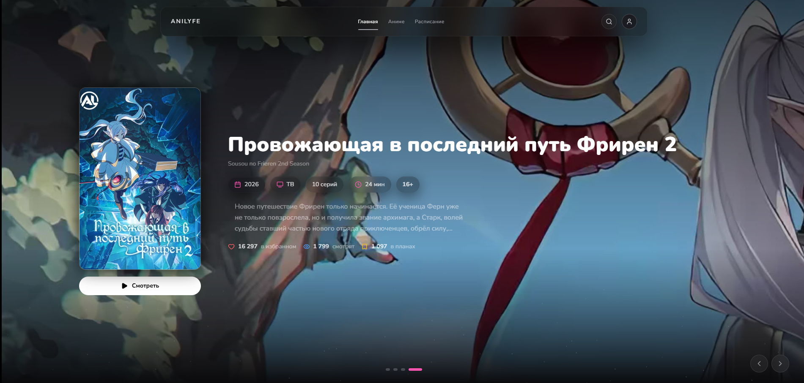
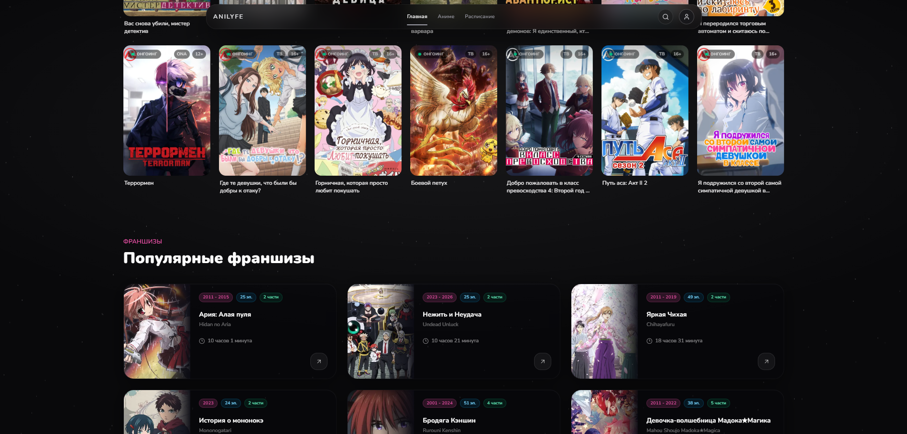
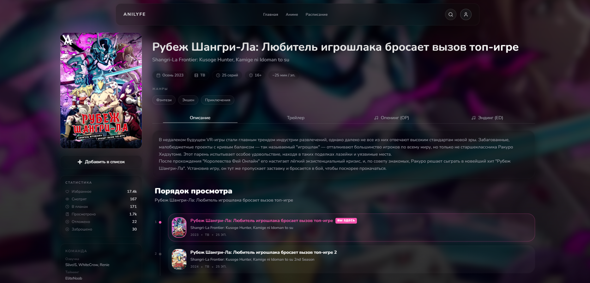
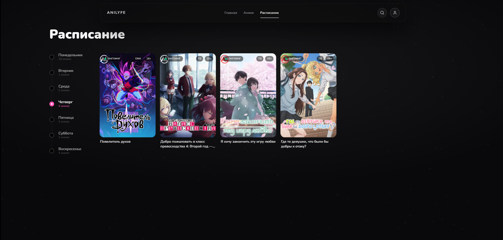

# Anilyfe

Anilyfe is a modern anime streaming platform built with a focus on user experience, speed, and clean design. It leverages modern web technologies to deliver a smooth and immersive viewing experience.

---

## Tech Stack

- **Framework:** Next.js (App Router)
- **UI & Styling:** Tailwind CSS, HeroUI, Framer Motion
- **Backend & Auth:** Supabase
- **Video Playback:** Vidstack, Artplayer
- **Data Source:** AniLiberty API

---

## Key Features

- **Dynamic Catalog** — advanced search, filters by genres, years, and seasonal releases
- **Premium Player** — HLS streaming, quality selection, smooth playback control
- **User Ecosystem** — watchlists (Planned, Watching, Completed), user profiles
- **Real-time Schedule** — seasonal anime release tracking
- **Responsive UI** — optimized for desktop and mobile
- **Fast Performance** — built with focus on speed andsmooth user experience

---

## Preview

  
  

  
  

