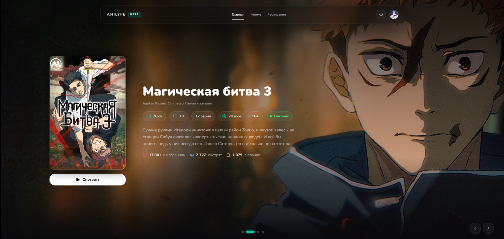

<div align="center">
  
  <br/>
  <h1>Anilyfe</h1>
  <p><strong>A modern streaming platform to watch anime online! 🚀</strong></p>

  <p>
    <a href="https://github.com/quincyqqe/anilyfe/stargazers"></a>
    <a href="https://github.com/quincyqqe/anilyfe/network/members"></a>
    <a href="https://github.com/quincyqqe/anilyfe/issues"></a>
  </p>
</div>

---

## Tech Stack

<p align="center">
  
  
  
  
  
  
</p>

## ✨ Features

-  **Anime Catalog** — Search and filter by genre, format, status, age rating, season, and year.
-  **Advanced Player** — Smooth HLS streaming with quality selection, opening/ending skip, and a robust episode list.
-  **Release Schedule** — Stay up-to-date with episodes sorted by day of the week.
-  **Detailed Title Pages** — Everything you need: posters, descriptions, genres, translation teams, stats, and related titles.
-  **Secure Accounts** — Effortless sign-up/sign-in using Supabase Auth (Email + OAuth).
-  **Personalized Anime List** — Track your journey: Watching / Completed / Dropped / Planned / On Hold.
-  **Public Profiles** — Share your anime taste with a unique public page linked to your username.
-  **Watch Progress** — Never lose your spot! We automatically save your current episode and playback position.

## Project Structure

```text
src/
├── app/                    # Next.js App Router — pages and routes
│   ├── (auth)/             # Sign up and sign in
│   └── (pages)/            # Main pages (home, catalog, schedule, profile, anime)
├── components/             # Reusable UI components (cards, header, footer, effects)
├── features/               # Domain-driven feature modules
│   ├── anime/              # Title page, player, info sections
│   ├── auth/               # Login and registration forms
│   ├── catalog/            # Filters, pagination, catalog utilities
│   ├── home/               # Promo slider, new releases
│   ├── player/             # HLS player, episode list
│   ├── profile/            # User profile, anime list
│   └── schedule/           # Episode release schedule
├── lib/
│   ├── db/
│   │   ├── queries.ts      # All Supabase read queries
│   │   └── actions/        # Server Actions for mutations
│   └── supabase/           # Supabase clients
├── providers/              # React providers
└── shared/                 # Shared types, constants, API client
```

## Getting Started

### Prerequisites

- **Node.js 20+**

### Installation

```bash
# Clone the repository
git clone https://github.com/quincyqqe/anilyfe.git
cd anilyfe

# Install dependencies using bun or npm
bun install
# or
npm install
```

### Environment Variables

Create a `.env.local` file in the project root:

```env
NEXT_PUBLIC_SUPABASE_URL=https://<your-project>.supabase.co
NEXT_PUBLIC_SUPABASE_PUBLISHABLE_KEY=<your-anon-key>
NEXT_PUBLIC_API_URL=https://api.aniliberty.top/v1
```

### Development

```bash
bun dev
# or
npm run dev
```

Open [http://localhost:3000](http://localhost:3000) in your browser.

### Production Build

```bash
bun run build
bun start
```

## 🗺 Roadmap

- [ ] 📈 **SEO** — Dynamic OpenGraph tags for title pages
- [ ] 💬 **Community** — Comments and ratings system
- [ ] 🔔 **Notifications** — Alerts for new episodes
- [ ] 📱 **Mobile App** — Bringing Anilyfe to iOS and Android

## Data Source

This project uses the public [AniLiberty API](https://aniliberty.top/api/docs/v1#/) to fetch anime metadata, schedules, promo materials, and streaming URLs.

---

<div align="center">
  Made with ❤️ by <a href="https://github.com/quincyqqe">quincyqqe</a>
</div>
